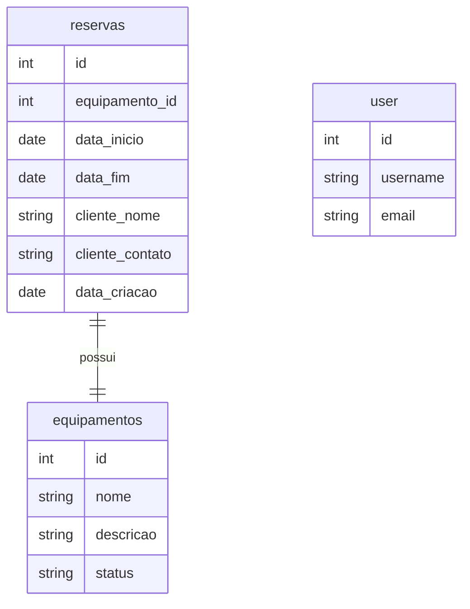

# Sistema de Gestão de Brinquedos para Festas

Desenvolvido com **Flask + SQLite**, criado para **cadastrar, reservar e gerenciar brinquedos infantis de aluguel** para festas e eventos.

## Imagens do Sistema

* Tela Principal  
  

* Modelagem Banco de Dados
  

* Reservas  
  
  
## Funcionalidades

* Cadastro e listagem de brinquedos
* Gestão de reservas (criar, finalizar e excluir)
* Dashboard com estatísticas
* Filtros e buscas avançadas
* Interface responsiva (desktop e mobile)

## Tecnologias

* Backend: Flask (Python)
* Banco de Dados: SQLite
* Frontend: Bootstrap 5 + Jinja2

## Melhorias Futuras

* Autenticação de usuários
* Relatórios em PDF
* Notificações por e-mail
* API REST para integração

